# AI Travel Planner - High-Level Design Document

## 1. Project Overview

### 1.1 Project Description
The AI Travel Planner is an intelligent web application that generates personalized travel itineraries using AI/LLM technology. Users input their destination city, interests, and trip duration to receive customized day-by-day travel recommendations including attractions, activities, restaurants, and local tips.

### 1.2 Key Features
- **AI-Powered Itinerary Generation**: Uses Groq's LLM API for intelligent travel planning
- **Interactive Web Interface**: Streamlit-based responsive UI with custom styling
- **Personalized Recommendations**: Tailored suggestions based on user interests
- **Structured Output**: Day-by-day itinerary with morning, afternoon, and evening plans
- **Real-time Streaming**: Progressive display of generated content
- **Comprehensive Logging**: Detailed logging for monitoring and debugging

### 1.3 Target Users
- Individual travelers seeking personalized itineraries
- Travel enthusiasts looking for AI-assisted planning
- Users who want quick, structured travel recommendations

## 2. System Architecture

### 2.1 High-Level Architecture Overview

```mermaid
graph TB
    subgraph "🌐 User Interface Layer"
        UI["🖥️ Streamlit Web App<br/>• Responsive Design<br/>• Custom Styling<br/>• Form Handling"]
        TEMP["🎨 Templates & Styling<br/>• CSS Animations<br/>• UI Components<br/>• Responsive Layout"]
    end
    
    subgraph "🧠 Business Logic Layer"
        PLANNER["📋 Travel Planner Core<br/>• Trip Orchestration<br/>• Data Validation<br/>• Workflow Management"]
        CHAIN["🔗 LLM Chain<br/>• AI Model Integration<br/>• Prompt Management<br/>• Response Processing"]
    end
    
    subgraph "🔧 Infrastructure Layer"
        CONFIG["⚙️ Configuration<br/>• YAML Settings<br/>• Environment Variables<br/>• Path Management"]
        UTILS["🛠️ Utilities<br/>• Logging System<br/>• Exception Handling<br/>• Common Functions"]
    end
    
    subgraph "☁️ External Services"
        GROQ["🤖 Groq API<br/>• LLM Processing<br/>• AI Generation<br/>• Natural Language"]
    end
    
    UI --> PLANNER
    PLANNER --> CHAIN
    CHAIN --> GROQ
    TEMP --> UI
    CONFIG --> PLANNER
    CONFIG --> CHAIN
    UTILS --> PLANNER
    UTILS --> CHAIN
    
    classDef frontend fill:#e1f5fe,stroke:#01579b,stroke-width:2px
    classDef business fill:#f3e5f5,stroke:#4a148c,stroke-width:2px
    classDef infra fill:#e8f5e8,stroke:#1b5e20,stroke-width:2px
    classDef external fill:#fff3e0,stroke:#e65100,stroke-width:2px
    
    class UI,TEMP frontend
    class PLANNER,CHAIN business
    class CONFIG,UTILS infra
    class GROQ external
```



### 2.2 Detailed System Flow

```mermaid
sequenceDiagram
    participant U as 👤 User
    participant ST as 🖥️ Streamlit UI
    participant TP as 📋 Travel Planner
    participant LLM as 🔗 LLM Chain
    participant API as 🤖 Groq API
    participant LOG as 📝 Logger
    
    U->>ST: Enter travel details
    ST->>TP: Initialize planner
    TP->>LOG: Log initialization
    
    ST->>TP: Set city, interests, days
    TP->>LOG: Log user inputs
    
    ST->>TP: Create itinerary
    TP->>LLM: Request AI generation
    LLM->>API: Send formatted prompt
    API-->>LLM: Return AI response
    LLM-->>TP: Process response
    TP->>LOG: Log successful generation
    TP-->>ST: Stream itinerary
    ST-->>U: Display results
    
    Note over U,LOG: Real-time streaming with comprehensive logging
```



### 2.3 Layered Architecture Design

```mermaid
graph LR
    subgraph "🎯 Presentation Layer"
        direction TB
        A1["🖥️ Streamlit Frontend"]
        A2["🎨 Custom Styling"]
        A3["📝 Form Components"]
        A4["✨ Animations"]
    end
    
    subgraph "🧠 Business Layer"
        direction TB
        B1["📋 Travel Planner"]
        B2["🔗 LLM Integration"]
        B3["🔄 Data Processing"]
        B4["✅ Validation"]
    end
    
    subgraph "🔧 Infrastructure Layer"
        direction TB
        C1["⚙️ Configuration"]
        C2["📝 Logging"]
        C3["🛡️ Exception Handling"]
        C4["🔐 Security"]
    end
    
    subgraph "💾 Data Layer"
        direction TB
        D1["📄 YAML Config"]
        D2["🔑 Environment"]
        D3["📊 Log Files"]
    end
    
    A1 --> B1
    A2 --> A1
    A3 --> A1
    A4 --> A1
    
    B1 --> B2
    B2 --> B3
    B3 --> B4
    
    B1 --> C1
    B2 --> C2
    B3 --> C3
    B4 --> C4
    
    C1 --> D1
    C1 --> D2
    C2 --> D3
    
    classDef presentation fill:#e3f2fd,stroke:#1976d2,stroke-width:2px
    classDef business fill:#f1f8e9,stroke:#388e3c,stroke-width:2px
    classDef infrastructure fill:#fce4ec,stroke:#c2185b,stroke-width:2px
    classDef data fill:#fff8e1,stroke:#f57c00,stroke-width:2px
    
    class A1,A2,A3,A4 presentation
    class B1,B2,B3,B4 business
    class C1,C2,C3,C4 infrastructure
    class D1,D2,D3 data
```



### 2.4 Component Interaction Matrix

| Component | Frontend | Planner | LLM Chain | Config | Utils | External API |
|-----------|----------|---------|-----------|--------|-------|-------------|
| **Frontend** | ● | ↔️ | - | - | ↔️ | - |
| **Planner** | ↔️ | ● | ↔️ | ↔️ | ↔️ | - |
| **LLM Chain** | - | ↔️ | ● | ↔️ | ↔️ | ↔️ |
| **Config** | - | ↔️ | ↔️ | ● | - | - |
| **Utils** | ↔️ | ↔️ | ↔️ | - | ● | - |
| **External API** | - | - | ↔️ | - | - | ● |

**Legend**: ● Self | ↔️ Bidirectional | → Unidirectional | - No Direct Interaction

## 3. Detailed Component Design

### 3.1 Core Components

#### 3.1.1 TravelPlanner Class (`core/planner.py`)
**Purpose**: Main orchestrator for travel planning workflow
**Key Methods**:
- `set_city(city: str)`: Sets destination city
- `set_interests(interests: str)`: Processes user interests
- `set_days(days: str)`: Sets trip duration
- `create_itinerary()`: Generates complete itinerary

#### 3.1.2 LLMModel Class (`chains/itinerary_chain.py`)
**Purpose**: Manages AI model integration and prompt processing
**Key Methods**:
- `initialization_of_model_and_prompt()`: Sets up Groq model and prompts
- `get_itinerary()`: Generates AI-powered travel recommendations

#### 3.1.3 Streamlit Application (`main.py`)
**Purpose**: Web interface and user interaction management
**Key Features**:
- Form-based input collection
- Real-time itinerary streaming
- Custom UI styling and animations
- Error handling and user feedback

### 3.2 Supporting Components

#### 3.2.1 Configuration System
- **YAML Configuration**: Model parameters and prompts
- **Path Management**: Centralized file path configuration
- **API Configuration**: Secure credential management

#### 3.2.2 Utility Services
- **Logger**: Structured logging with timestamps and file rotation
- **Exception Handler**: Custom exception management
- **Common Functions**: Shared utilities (YAML reading, data streaming)

#### 3.2.3 UI Templates
- **Custom Styling**: Modern gradient-based design
- **Responsive Layout**: Mobile-friendly interface
- **Interactive Elements**: Animated components and effects

## 4. Project Structure & Architecture

### 4.1 Directory Tree with Visual Hierarchy

```mermaid
graph TD
    ROOT["🏠 AI-TRAVELL-PLANNER/"]
    
    subgraph "🧠 Core Business Logic"
        CORE["📁 core/"]
        CHAINS["📁 chains/"]
        CORE_PY["📄 planner.py"]
        CHAIN_PY["📄 itinerary_chain.py"]
    end
    
    subgraph "🎨 User Interface"
        TEMPLATES["📁 templates/"]
        MAIN["📄 main.py"]
        STYLE["📄 style.py"]
    end
    
    subgraph "⚙️ Configuration"
        CONFIG["📁 config/"]
        CONFIG_YAML["📄 config.yaml"]
        API_CONFIG["📄 api_config.py"]
        PATH_CONFIG["📄 path_config.py"]
    end
    
    subgraph "🛠️ Utilities"
        UTILS["📁 utils/"]
        LOGGER["📄 logger.py"]
        EXCEPTION["📄 custom_exception.py"]
        COMMON["📄 common_function.py"]
    end
    
    subgraph "📊 Data & Logs"
        LOGS["📁 logs/"]
        ENV["📄 .env"]
        LOG_FILES["📄 log_YYYY-MM-DD.log"]
    end
    
    subgraph "🔧 Development"
        VENV["📁 planner_env/"]
        REQ["📄 requirements.txt"]
        SETUP["📄 setup.py"]
    end
    
    ROOT --> CORE
    ROOT --> CHAINS
    ROOT --> TEMPLATES
    ROOT --> CONFIG
    ROOT --> UTILS
    ROOT --> LOGS
    ROOT --> MAIN
    ROOT --> VENV
    ROOT --> REQ
    ROOT --> SETUP
    ROOT --> ENV
    
    CORE --> CORE_PY
    CHAINS --> CHAIN_PY
    TEMPLATES --> STYLE
    CONFIG --> CONFIG_YAML
    CONFIG --> API_CONFIG
    CONFIG --> PATH_CONFIG
    UTILS --> LOGGER
    UTILS --> EXCEPTION
    UTILS --> COMMON
    LOGS --> LOG_FILES
    
    classDef core fill:#e8f5e8,stroke:#2e7d32,stroke-width:2px
    classDef ui fill:#e3f2fd,stroke:#1976d2,stroke-width:2px
    classDef config fill:#fff3e0,stroke:#f57c00,stroke-width:2px
    classDef utils fill:#f3e5f5,stroke:#7b1fa2,stroke-width:2px
    classDef data fill:#fce4ec,stroke:#c2185b,stroke-width:2px
    classDef dev fill:#f1f8e9,stroke:#388e3c,stroke-width:2px
    
    class CORE,CHAINS,CORE_PY,CHAIN_PY core
    class TEMPLATES,MAIN,STYLE ui
    class CONFIG,CONFIG_YAML,API_CONFIG,PATH_CONFIG config
    class UTILS,LOGGER,EXCEPTION,COMMON utils
    class LOGS,ENV,LOG_FILES data
    class VENV,REQ,SETUP dev
```



### 4.2 Module Dependency Graph


## 5. Data Flow Architecture

### 5.1 Complete User Journey Visualization


### 5.2 Detailed Data Processing Flow

```mermaid
flowchart TD
    START(["👤 User Starts"]) --> INPUT["📝 Input Form<br/>• City<br/>• Interests<br/>• Days"]
    
    INPUT --> VALIDATE{"✅ Validate<br/>Input?"}
    VALIDATE -->|❌ Invalid| ERROR["⚠️ Show Error<br/>Message"]
    ERROR --> INPUT
    
    VALIDATE -->|✅ Valid| INIT["🚀 Initialize<br/>Travel Planner"]
    INIT --> SET_DATA["📋 Set User Data<br/>• set_city()<br/>• set_interests()<br/>• set_days()"]
    
    SET_DATA --> CREATE["🔄 Create Itinerary<br/>create_itinerary()"]
    CREATE --> LLM_INIT["🤖 Initialize<br/>LLM Model"]
    
    LLM_INIT --> PROMPT["📝 Format Prompt<br/>with User Data"]
    PROMPT --> API_CALL["☁️ Call Groq API<br/>Send Formatted Prompt"]
    
    API_CALL --> API_RESPONSE{"📡 API<br/>Response?"}
    API_RESPONSE -->|❌ Error| API_ERROR["🚨 Handle<br/>API Error"]
    API_ERROR --> LOG_ERROR["📝 Log Error"]
    LOG_ERROR --> ERROR
    
    API_RESPONSE -->|✅ Success| PROCESS["🔄 Process<br/>AI Response"]
    PROCESS --> STREAM["📺 Stream Results<br/>to UI"]
    
    STREAM --> DISPLAY["🎯 Display<br/>Itinerary"]
    DISPLAY --> LOG_SUCCESS["📝 Log Success"]
    LOG_SUCCESS --> END(["✨ Journey Complete"])
    
    classDef start fill:#e8f5e8,stroke:#4caf50,stroke-width:3px
    classDef process fill:#e3f2fd,stroke:#2196f3,stroke-width:2px
    classDef decision fill:#fff3e0,stroke:#ff9800,stroke-width:2px
    classDef error fill:#ffebee,stroke:#f44336,stroke-width:2px
    classDef end fill:#f3e5f5,stroke:#9c27b0,stroke-width:3px
    
    class START,END start
    class INPUT,INIT,SET_DATA,CREATE,LLM_INIT,PROMPT,API_CALL,PROCESS,STREAM,DISPLAY,LOG_SUCCESS process
    class VALIDATE,API_RESPONSE decision
    class ERROR,API_ERROR,LOG_ERROR error
```

### 5.3 Real-time Data Streaming Architecture

```mermaid
sequenceDiagram
    participant UI as 🖥️ Streamlit UI
    participant TP as 📋 Travel Planner
    participant LLM as 🔗 LLM Chain
    participant API as 🤖 Groq API
    participant STREAM as 📺 Stream Handler
    participant LOG as 📝 Logger
    
    Note over UI,LOG: Real-time Streaming Process
    
    UI->>TP: User submits form
    TP->>LOG: Log user input
    
    TP->>LLM: Initialize model
    LLM->>API: Send prompt
    
    loop Streaming Response
        API-->>LLM: Chunk of response
        LLM-->>TP: Process chunk
        TP-->>STREAM: Format chunk
        STREAM-->>UI: Display chunk
        UI-->>UI: Update display
    end
    
    TP->>LOG: Log completion
    UI->>UI: Show final result
    
    Note over UI,LOG: Complete itinerary displayed with real-time updates
```



## 6. Technology Stack

### 6.1 Core Technologies
- **Python 3.x**: Primary programming language
- **Streamlit**: Web framework for UI
- **LangChain**: LLM integration framework
- **Groq API**: AI/LLM service provider

### 6.2 Dependencies
```
langchain              # LLM framework
langchain_core         # Core LangChain components
langchain_groq         # Groq API integration
langchain_community    # Community extensions
streamlit              # Web framework
python-dotenv          # Environment variable management
setuptools             # Package management
```

### 6.3 Development Tools
- **Virtual Environment**: Isolated Python environment
- **YAML Configuration**: Structured configuration management
- **Logging Framework**: Built-in Python logging
- **Git**: Version control system

## 7. Configuration Management

### 7.1 Model Configuration (`config/config.yaml`)
```yaml
Model_Params:
  model_name: "openai/gpt-oss-20b"
  temperature: 0.3
  max_tokens: 2000

Itinerary_prompts:
  system: "Travel planner assistant prompt..."
  human: "Create itinerary request..."
```

### 7.2 Environment Variables (`.env`)
- `GROQ_API_KEY`: Secure API key storage
- Additional environment-specific configurations

## 8. Security Considerations

### 8.1 API Security
- Environment-based API key management
- No hardcoded credentials in source code
- Secure credential loading via python-dotenv

### 8.2 Input Validation
- User input sanitization
- Error handling for malformed requests
- Logging of security-relevant events

### 8.3 Data Privacy
- No persistent storage of user data
- Session-based data handling
- Minimal data collection approach

## 9. Development Lifecycle

### 9.1 Development Phases

#### Phase 1: Foundation Setup ✅
- Project structure creation
- Core dependencies installation
- Basic configuration setup
- Virtual environment setup

#### Phase 2: Core Development ✅
- Travel planner logic implementation
- LLM integration with Groq API
- Basic Streamlit interface
- Configuration management

#### Phase 3: UI Enhancement ✅
- Custom styling and themes
- Responsive design implementation
- User experience improvements
- Form validation and error handling

#### Phase 4: Testing & Optimization
- Unit testing implementation
- Performance optimization
- Error handling enhancement
- Documentation completion

#### Phase 5: Deployment & Monitoring
- Production deployment setup
- Monitoring and logging enhancement
- User feedback integration
- Continuous improvement

### 9.2 Development Workflow
1. **Local Development**: Virtual environment with hot reload
2. **Testing**: Manual testing with various input scenarios
3. **Version Control**: Git-based source control
4. **Configuration**: YAML-based parameter management
5. **Logging**: Comprehensive logging for debugging

## 10. Deployment Architecture

### 10.1 Local Deployment
```bash
# Environment setup
python -m venv planner_env
source planner_env/Scripts/activate  # Windows
pip install -r requirements.txt

# Configuration
cp .env.example .env  # Add API keys

# Run application
streamlit run main.py
```

### 10.2 Production Considerations
- **Containerization**: Docker support for consistent deployment
- **Environment Management**: Separate configs for dev/prod
- **Monitoring**: Enhanced logging and error tracking
- **Scalability**: Stateless design for horizontal scaling

## 11. Monitoring & Maintenance

### 11.1 Logging Strategy
- **Daily Log Rotation**: Automatic log file management
- **Structured Logging**: Consistent log format with timestamps
- **Error Tracking**: Comprehensive exception logging
- **Performance Monitoring**: Request/response time tracking

### 11.2 Maintenance Tasks
- **Log Management**: Regular log cleanup and archival
- **Dependency Updates**: Regular package updates
- **API Monitoring**: Groq API usage and rate limiting
- **Performance Optimization**: Response time improvements

## 12. Future Enhancements

### 12.1 Planned Features
- **Multi-language Support**: International user base
- **Itinerary Export**: PDF/Email export functionality
- **User Preferences**: Saved user profiles and preferences
- **Advanced Filtering**: Budget, accessibility, weather considerations
- **Social Features**: Itinerary sharing and collaboration

### 12.2 Technical Improvements
- **Database Integration**: Persistent storage for user data
- **Caching Layer**: Response caching for performance
- **API Rate Limiting**: Enhanced API usage management
- **Testing Framework**: Comprehensive test suite
- **CI/CD Pipeline**: Automated deployment workflow

## 13. Conclusion

The AI Travel Planner represents a modern, AI-powered solution for personalized travel planning. Its modular architecture, comprehensive logging, and user-friendly interface make it a robust foundation for travel recommendation services. The project demonstrates best practices in Python development, AI integration, and web application design while maintaining simplicity and extensibility for future enhancements.

---

**Document Version**: 1.0  
**Last Updated**: January 2025  
**Author**: AI Travel Planner Development Team